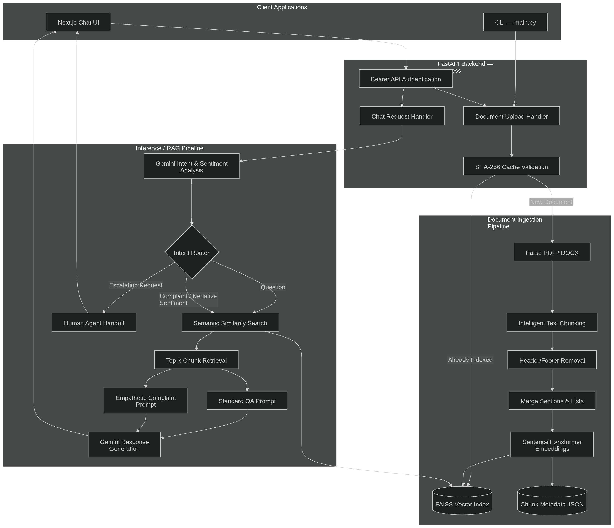

# AI Customer Support System

An intelligent, full-stack customer support assistant for small and medium-sized businesses. Upload company knowledge bases (PDF or DOCX), then chat with an AI that answers questions from your documents, detects user intent and sentiment, responds empathetically to complaints, and escalates to human agents when needed.

## Live Demo

https://youtu.be/hA9zglc4x1w

<a href="https://youtu.be/hA9zglc4x1w">
  
</a>

---

## Overview

This system gives SMEs a 24/7 support layer grounded in their own documentation. Instead of generic chatbot replies, answers are retrieved from uploaded files via a **Retrieval-Augmented Generation (RAG)** pipeline. A triage step classifies each message by **intent** (question, complaint, escalation) and **sentiment**, then routes the request to the appropriate response strategy.

## Features

- **Document-grounded Q&A** — Upload PDF or DOCX files to build a searchable knowledge base
- **Multi-turn conversations** — Chat history is passed to the model for contextual replies
- **Intent & sentiment triage** — Gemini classifies each query before generation
- **Empathetic handling** — Complaints and negative sentiment trigger supportive, context-aware responses
- **Smart escalation** — Explicit requests for a human agent receive an immediate handoff message
- **Cached ingestion** — Documents are hashed (SHA-256); re-uploading the same file skips re-indexing
- **CLI & API** — Use the web UI, REST API, or terminal chat via `main.py`

## Tech Stack

| Layer | Technologies |
| :--- | :--- |
| **Frontend** | React, Next.js 13, TypeScript, Tailwind CSS, shadcn/ui, Radix UI |
| **Backend** | Python, FastAPI, Uvicorn |
| **AI / ML** | Google Gemini (`gemini-1.5-flash-latest`), Sentence Transformers (`all-MiniLM-L6-v2`), FAISS |
| **Document parsing** | PyMuPDF (PDF), python-docx (DOCX) |
| **Deployment** | Docker, Vercel (frontend), Hugging Face Spaces (backend) |

## Architecture



### Project structure

```
customer-ai-support-system/
├── backend/
│   ├── app.py                      # FastAPI server (REST API)
│   ├── main.py                     # CLI: ingest document + interactive chat
│   ├── ingestion_pipeline/
│   │   └── ingestionPipeline.py    # Parse, chunk, embed, index
│   ├── inference_pipeline/
│   │   └── inferencePipeline.py    # Triage, search, generate
│   ├── knowledge_base_cache/       # Per-document FAISS index + chunk JSON
│   ├── requirements.txt
│   └── Dockerfile
└── frontend/
    └── phantom-agent/              # Next.js application
        ├── app/
        ├── components/
        └── package.json
```

## How it works

### 1. Ingestion pipeline

When a document is uploaded (via the API or CLI):

1. **Hash** — SHA-256 of file bytes becomes the document ID
2. **Cache check** — If `{hash}.index` exists in `knowledge_base_cache/`, ingestion is skipped
3. **Parse** — PDF pages are processed in parallel (PyMuPDF); DOCX is split by paragraph with page heuristics
4. **Chunk** — Headers/footers are suppressed; list items and section headers are merged intelligently
5. **Vectorize** — Chunks are embedded with `all-MiniLM-L6-v2` and stored in a FAISS `IndexFlatL2`

### 2. Inference pipeline

For each user message:

1. **Triage** — Gemini returns JSON with `intent` (Question | Complaint | Escalate) and `sentiment` (Positive | Neutral | Negative)
2. **Route**
   - **Escalate** → immediate human handoff message (no RAG)
   - **Complaint / Negative** → semantic search + empathetic answer prompt
   - **Question** → semantic search + standard Q&A prompt
3. **Semantic search** — Query embedding retrieves top-5 relevant chunks from FAISS
4. **Generate** — Retrieved context and query are sent to Gemini with a path-specific prompt

## Getting started

### Prerequisites

- Python 3.11+
- Node.js 18+
- A [Google Gemini API key](https://aistudio.google.com/apikey)

### Backend

```bash
cd backend

python -m venv venv
source venv/bin/activate   # Windows: venv\Scripts\activate

pip install -r requirements.txt
```

Create `backend/.env`:

```env
API_KEY=your-api-key-for-bearer-auth
GEMINI_API_KEY=your-google-gemini-api-key
```

**Option A — REST API**

```bash
uvicorn app:app --host 0.0.0.0 --port 8000 --reload
```

API docs: `http://127.0.0.1:8000/docs`

**Option B — CLI (no server)**

```bash
python main.py /path/to/your-knowledge-base.pdf
```

### Frontend

```bash
cd frontend/phantom-agent

npm install
npm run dev
```

Open `http://localhost:3000`. Point the chat client at your local backend URL (or your deployed API) and set the `Authorization: Bearer <API_KEY>` header to match `backend/.env`.

### Docker (backend)

```bash
cd backend
docker build -t customer-ai-support-api .
docker run -p 7860:7860 --env-file .env customer-ai-support-api
```

## API reference

**`POST /process`** (requires `Authorization: Bearer <API_KEY>`)

| Field | Type | Required | Description |
| :--- | :--- | :---: | :--- |
| `query` | string (form) | Yes | User message |
| `history` | JSON string (form) | No | `[{"role":"user","content":"..."}, ...]` |
| `document` | file (form) | No | PDF or DOCX to ingest; omit to use the active document |

**Response**

```json
{
  "answer": "...",
  "document_hash": "sha256-hex"
}
```

## Environment variables

| Variable | Description |
| :--- | :--- |
| `GEMINI_API_KEY` | Google Generative AI API key |
| `API_KEY` | Bearer token for `/process` authentication |

---

Built as a production-oriented RAG assistant for document-driven customer support.
